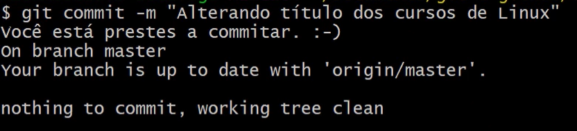
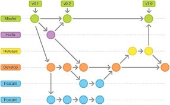

# Alura - Git e Github: estratégias de ramificação, Conflitos e Pull Requests

Importância: ⚡⚡⚡
Dificuldade/5: ⭐️⭐️⭐️
Status: In progress
Tipo: Programação

[Git School - Aprender git](https://git-school.github.io/visualizing-git/)

- **01 Github e Opensource**
    
    Open source: Metodologias de codigo aberto onde todos podem modificar
    
    Inssues: São os comentarios/recomendaçoes referentes a algum repositorio de codigo aberto
    
    Pull requests : Pedido de envio para alterações feitas por terceiros em nossos repositórios feitos pela comunidade
    
    Através de *pull requests*, os principais mantenedores de um projeto podem analisar todas as alterações, aprová-las ou reprová-las, dar feedback e interagir de uma forma geral. *Pull requests* não são utilizados apenas para projetos *Open Source*. Muitas equipes utilizam *pull requests* em seu dia-a-dia, para enviar as alterações de código para revisão de algum supervisor.
    
    Unindo commits:
    
     Unir commits com:
    
    ```bash
    git rebase -i <numero_commit>
    ```
    
- **02 Controle Avançado de conflitos!**
    
    
    Pegar commit de outra branch:
    
    Traz um commit feito em uma branch para outra
    
    ```bash
    git cherry-pick <hash do commit>
    ```
    
    Buscando bugs:
    
    Como navegar pelos commits:
    
    Inicia a busca
    
    ```bash
    git bisect start
    ```
    
    informar onde a alteração n esta boa:
    
    ```bash
    git bisect bad HEAD
    ```
    
    informar onde possivelmente estava bom:
    
    ```bash
    git bisect good <hash do commit>
    ```
    
    se não achar de primeira faça:
    
    ```bash
    git bisect bad
    ```
    
    para continuar a procura
    
    se tiver achado a parte:
    
    ```bash
    git bisect good
    ```
    
    para finalizar a busca
    
    ```bash
    git bisect reset
    ```
    
    ele mostrara o codigo hash do commit para ser reutilizado
    
    Encontrar culpado por um commit errado:
    
    ```bash
    git blame <nomearquivo.ext>
    ```
    
    motra quem commitou cada linha do arquivo
    
- **03 Estrategias de branching**
    
    Branch Master e a ideal para se fazer deploy 
    
    Master por convenção o codigo final deve estar na Master e o desenvolvimento deve ser feito em outras branches
    
    ---
    
    Como remover uma branch
    
    ```bash
    git branch -d <nome_branch>
    ```
    
    Se por acaso a branch estiver com commits mais avançados que a branch master e mesmo assim presisa ser removida usa-se este comando
    
    ```bash
    git branch -D <nome_branch>
    ```
    
    ### Branch Master
    
    Principal onde o código final deve estar
    
    ### Branch Development
    
    O branch mais proximo de master onde devem ser testados bugs e features para irem para n irem pra master
    
    ### Branch feature/nome_feature
    
    Onde devem ser colocadas novas funcionalidades e unidadas todas essas na **development**
    
    ### Branch release/version ex: v0.2.2
    
    brach que deve conter os codigos para serrem testados antes de serem enviados para produção
    
    ### Branch hotfix/version ex: v0.1.1
    
    branch onde serão resolvidos problemas na produção (alterações seram enviadas para master e development)
    
    ## GIT FLOW
    
    
    
- **04 Ferramentas Visuais**
    - Git cola [***link***](https://git-cola.github.io/)
    - Github Desktop [***link***](https://desktop.github.com/)
    - Gitkraken [***link***](https://www.gitkraken.com/)
    
- **05 Hooks e Deploy com Git**
    
    Git hoook e um evento dentro do git
    
    “Quando algo acontecer faça algo”
    
    Quando algum comando do git for feito no terminal ele executara uma ação padrão que pode ser configurada por nois
    
    como no exemplo abaixo
    
    
    
    Todas as vezes que um commit for feito sera mostrada a mensagem Você está prestes a commitar. :-)
    
    Isso pode ser feito de tal forma que pode ser configurado para toda vez que for feito um git push ser feito tbm um deploy da versão